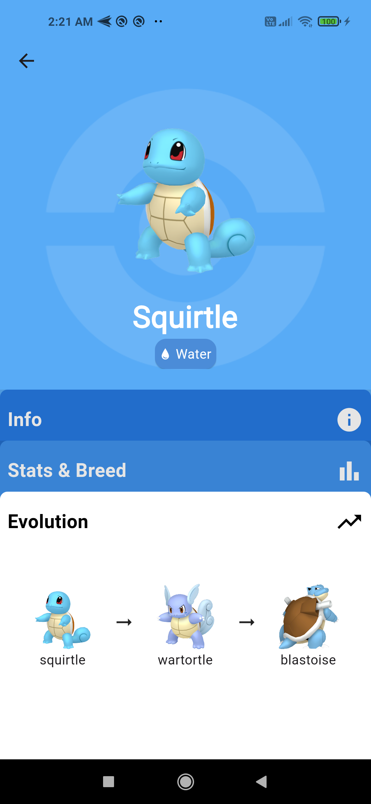

# 🌟 Flutter Pokédex 🌟 (Only android/iOS)

### Description

**Pokedex** is a modern and user-friendly application that allows users to explore and get detailed information about various Pokémon. With a visually appealing interface inspired by the design showcased on [Dribbble](https://dribbble.com/shots/14184018-Pok-dex-App-V-2), the project displays each Pokémon with its identification number, type, image, and additional details such as height, weight, and abilities.

### What is the Project?

Pokedex is a digital tool designed for Pokémon enthusiasts and those interested in learning more about the diverse creatures of the Pokémon world. The goal is to provide an interactive and educational experience, allowing users to discover more about their favorite Pokémon, their abilities, types, and unique characteristics.

### Requirements

To utilize the Pokedex application, you will need:
- Internet access to retrieve the most recent Pokémon data.
- **Flutter Version**: min 3.13.7
- **Dart Version**: min 3.1.3

### Screenshots

Certainly! When including screenshots in your `README.md`, you can utilize markdown formatting to display them. Here's how you can do it:

### Screenshots

#### Loading Screen

#### Main Screen

#### Pokémon Details Screen

### Credits

- **API**: This project utilizes the [PokeAPI](https://pokeapi.co/). Comprehensive details and the API documentation can be found at the [PokeAPI GitHub repository](https://github.com/PokeAPI/pokeapi).
  
- **UI Design Inspiration**: Drawn from the design featured on [Akira Chirakijja
](https://dribbble.com/shots/14184018-Pok-dex-App-V-2).
